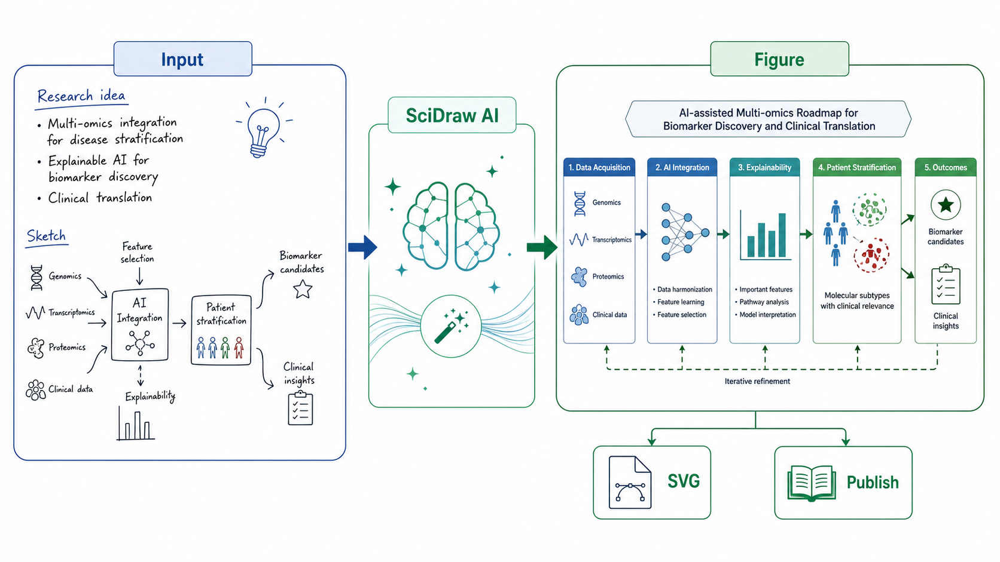
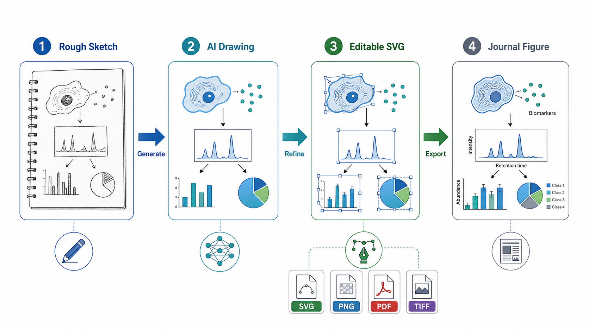
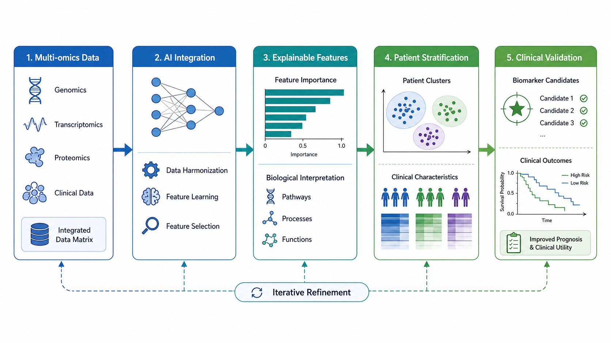
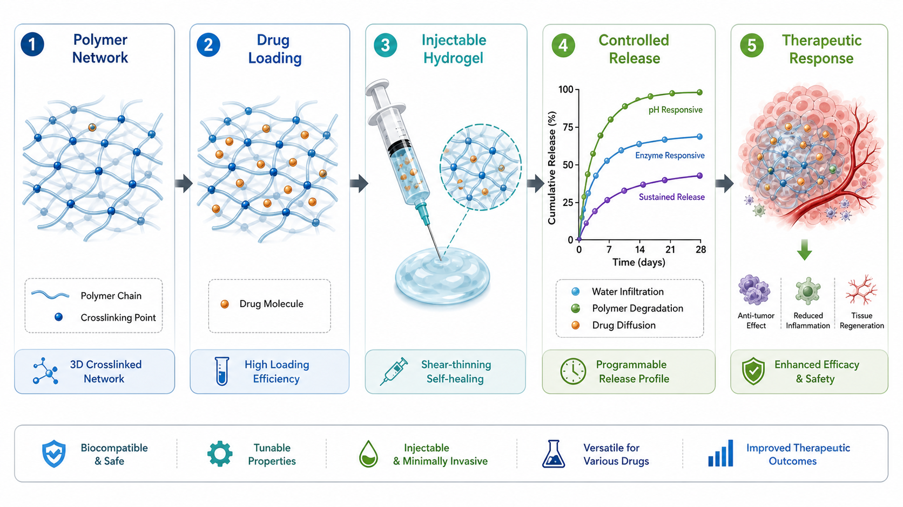
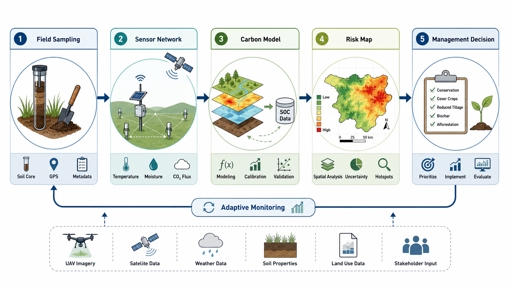

# SciDraw AI 科研画图 Skill

[](./README_en.md)
[](https://sci-draw.com/ai-drawing)
[](https://github.com/TopLocalAI/scidraw-ai-scientific-illustration-skill/stargazers)
[](https://github.com/TopLocalAI/scidraw-ai-scientific-illustration-skill/forks)

一个面向 Codex 的科研画图 skill，也可在 Claude Code、OpenClaw、Hermes Agent 等支持 `SKILL.md` 的 agent 中使用。它的目标非常明确：把研究想法、论文方法、基金路线、实验流程或模型结构转换成高质量科研图像。

> [!TIP]
> 这个 skill 支持两类生成路径：Codex 内置 ImageGen，或当前 agent 已配置好的图片生成 API。  
> 如果你既没有内置 ImageGen，也没有可用的图片 API，可以使用 [SciDraw AI](https://sci-draw.com/ai-drawing) 在线生成：
>
> - [AI Drawing 主入口](https://sci-draw.com/ai-drawing)
> - [SciDraw AI 官网](https://sci-draw.com/)
> - [图片转 SVG/PPTX/PDF/TIFF 等转换工具](https://sci-draw.com/convert)
>
> SciDraw AI 平台支持 AI Drawing、草图转专业图、图片编辑、SVG/PPTX 可编辑导出、PNG/PDF/TIFF 出版级导出等能力；本 skill 覆盖 agent 里的科研图生成与提示词整理流程。

## 温馨提示

这个 skill 不是完整的 SciDraw AI 产品，也不是可编辑 PPT 或 SVG 生成器。它更像一个轻量工作流：在 agent 对话中，让模型先理解你的科研表达目标，再优先调用内置 ImageGen 生成科研图初稿。

如果你已经在使用 SciDraw AI 网站，建议把这个 skill 当作补充：用于在 Codex 里快速试图、沉淀提示词、整理科研图结构；最终需要 SVG、PPTX、批量转换或出版格式导出时，再回到 SciDraw AI 平台完成。

## 特点

- 逐图迭代：默认按单幅科研图组织提示词和输出，方便确认结构、风格和标签；需要多张图时可以按图逐张生成。
- Codex 优先：在支持内置 ImageGen 的环境中，默认走内置图像能力，不要求 API key。
- 支持图片 API：如果当前 agent 支持外部图片 API，可使用用户已配置的模型、API key 和 base URL 完成生成。
- 无可用生成后端时给出替代入口：如果既没有 ImageGen，也没有图片 API，再提示使用 SciDraw AI 网站。
- 科研场景友好：适合技术路线图、机制示意图、方法流程图、模型结构图、研究框架图和图文摘要草稿。
- 源图约束：当用户提供实验图、截图、坐标轴或论文原图时，可要求保留关键标签、数值、单位和结构关系。
- 平台互补：需要 SVG/PPTX 可编辑导出、PNG/PDF/TIFF 出版级导出、多轮编辑和完整项目管理时，推荐使用 SciDraw AI 网站。

## 生成效果

### 从研究想法到科研图

[](https://sci-draw.com/ai-drawing)

### 科研图示例

| 英文标签工作流 | 英文标签生物标志物路线图 |
| --- | --- |
| [](https://sci-draw.com/ai-drawing) | [](https://sci-draw.com/ai-drawing) |

| 水凝胶药物递送机制图 | 土壤碳监测工作流 |
| --- | --- |
| [](https://sci-draw.com/ai-drawing) | [](https://sci-draw.com/ai-drawing) |

## 适用场景

- 国家自然科学基金、社科基金、课题申报中的技术路线图和研究框架图
- 论文 graphical abstract、TOC graphic、机制示意图、方法流程图
- 毕业论文、答辩、课程汇报中的科研流程说明图
- AI 模型结构、数据处理 pipeline、系统架构与实验设计图
- 将草稿级研究想法整理成可继续编辑的视觉初稿

## 输出结构

默认按单幅科研图产出图片文件，便于逐张确认和继续修改：

```text
{输出目录}/
└── figure_YYYYMMDD_HHMMSS.png
```

如果用户指定输出路径，skill 会优先使用用户指定路径。README 中的示例图位于：

```text
assets/examples/
├── imagegen-demo-scidraw-workflow.png
├── english-sketch-to-export.png
├── english-biomarker-workflow.png
├── english-hydrogel-delivery.png
└── english-soil-carbon-monitoring.png
```

## 安装

### 一句话安装

可以直接把下面这句话发给你的 Agent：

```text
请帮我安装这个 SciDraw AI 科研画图 skill，链接是：https://github.com/TopLocalAI/scidraw-ai-scientific-illustration-skill
```

### 手动安装到 Codex

```bash
npx -y skills@latest add TopLocalAI/scidraw-ai-scientific-illustration-skill \
  --skill scidraw-ai-scientific-figure \
  --agent codex \
  --global
```

也可以使用 GitHub CLI 的 Agent Skills 命令安装：

```bash
gh skill install TopLocalAI/scidraw-ai-scientific-illustration-skill \
  scidraw-ai-scientific-figure \
  --agent codex \
  --scope user
```

安装完成后，重启 Codex 让新 skill 生效。

## ImageGen 与 API

> [!TIP]
> 在 Codex 中，如果内置 ImageGen 可用，通常不需要配置 API key。你可以直接让 agent 使用这个 skill 生成科研图。

如果当前 agent 没有内置 ImageGen，但你有图片生成 API，也可以继续使用本 skill。你只需要把当前 API 服务要求的关键信息提供给 agent，例如：

- 图片模型名
- API key
- base URL
- 当前 agent 所要求的其他图片生成参数

具体的 API adapter 调用方式写在 `skills/scidraw-ai-scientific-figure/SKILL.md` 中，由 agent 在需要时读取并执行；普通用户不需要手动运行脚本。

如果当前环境既没有内置 ImageGen，也没有可用的图片 API，可以使用 [SciDraw AI 在线生成](https://sci-draw.com/ai-drawing)。

## 使用方式

在 Codex、Claude Code、OpenClaw 或 Hermes Agent 中明确指定使用本 skill，例如：

```text
请使用 scidraw-ai-scientific-figure skill 生成 16:9 的国自然技术路线图。
```

建议你的提示词包含这些信息：

1. 图像用途：论文图、基金图、答辩图、课程图、模型结构图
2. 画幅比例：16:9、4:3、1:1 或期刊指定尺寸
3. 结构主线：问题、方法、数据、验证、输出
4. 文字语言：中文、英文，或中文为主加英文术语
5. 视觉风格：白底、学术配色、低饱和、清晰箭头、模块分层
6. 保留约束：需要保留的标签、坐标、图例、单位、Logo 或源图内容

示例提示词：

```text
请使用 scidraw-ai-scientific-figure skill 生成科研技术路线图。
比例：16:9 横版。
主题：基于多组学数据的疾病分型与生物标志物发现。
结构：数据采集 -> AI 融合建模 -> 可解释性分析 -> 患者分层 -> 临床验证。
风格：白底，蓝绿色学术配色，模块清晰，箭头方向明确。
文字：中文为主，保留 Multi-omics、Biomarker 等必要英文术语。
```

## 使用技巧

- 不要只写“帮我画一个科研图”，要写清楚模块、箭头关系和最终输出。
- 中文图建议控制文字密度，避免把整段论文摘要塞进画面。
- 如果图用于基金申请，优先写“科学问题、研究内容、技术路线、验证闭环”。
- 如果图用于论文 graphical abstract，优先写“核心发现、关键机制、方法和应用场景”。
- 如果对标签、坐标轴或实验图有严格要求，请明确写“这些内容必须保留，不要重写或替换”。

## 与 SciDraw AI 平台的关系

本 skill 是 [SciDraw AI](https://sci-draw.com/ai-drawing) 工作流在 agent 生态中的轻量入口；SciDraw AI 平台是完整产品。

这些能力由 SciDraw AI 平台提供：

- [AI Drawing 在线生成](https://sci-draw.com/ai-drawing)
- 草图转专业科研图
- 上传图片后继续编辑
- 图片转可编辑 SVG
- 图片转 PPTX 可编辑文本层
- PNG、PDF、TIFF 等出版级导出
- 面向论文、基金、海报和课件的完整工作流

## FAQ

- 没有 API key 能用吗？  
  在 Codex 内置 ImageGen 可用时可以直接用；如果没有内置能力，但当前 agent 已配置图片 API，也可以使用 API 生成。
- 这个 skill 能生成 SVG 吗？  
  这个 skill 本身输出图片。需要 SVG/PPTX 可编辑导出时，请使用 SciDraw AI 平台的转换工具。
- 可以生成多张图吗？  
  可以，但建议按图逐张生成，这样更容易控制每张图的结构、标签和风格一致性。需要批量转换、可编辑导出或完整项目管理时，建议使用 SciDraw AI 平台。
- 生成的图能直接投稿吗？  
  需要作者核对科学准确性、标签、单位和期刊格式。SciDraw AI 平台提供更完整的导出与转换流程。

## 更多 SciDraw AI

完整的科研画图体验可以在 [SciDraw AI](https://sci-draw.com/ai-drawing) 中完成：

- [AI Drawing](https://sci-draw.com/ai-drawing)
- [官网](https://sci-draw.com/)
- [转换工具](https://sci-draw.com/convert)

## 许可证

MIT
