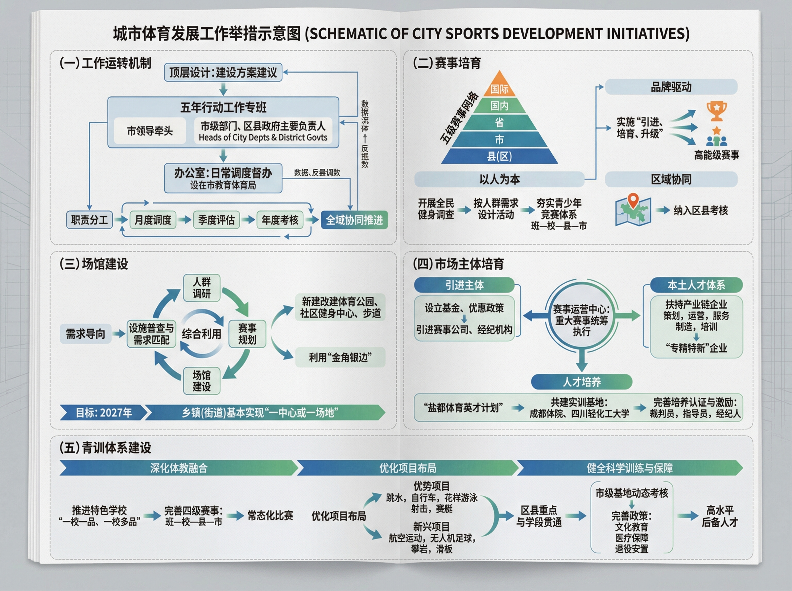
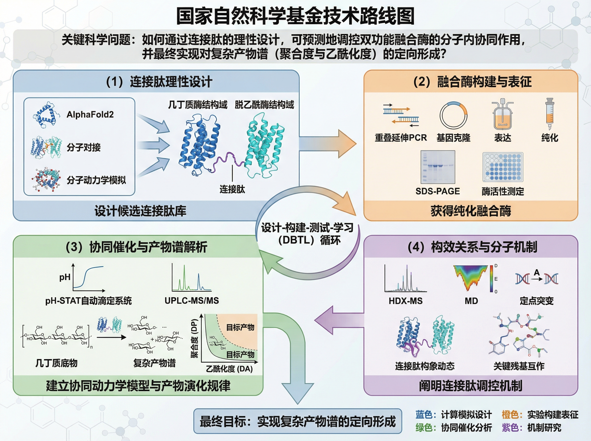
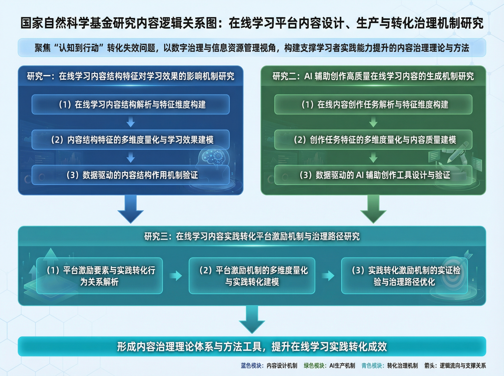
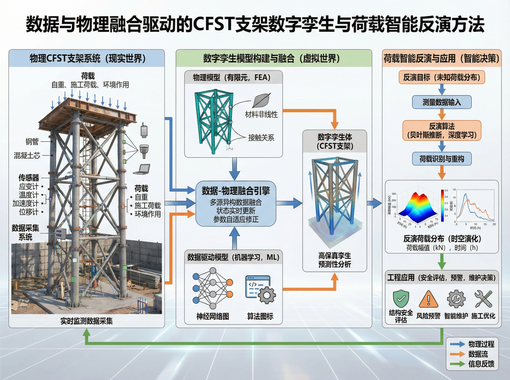

# SciDraw AI 科研画图 Skill

[](./README.en.md)
[](https://github.com/TopLocalAI/scidraw-ai-scientific-illustration-skill/stargazers)
[](https://github.com/TopLocalAI/scidraw-ai-scientific-illustration-skill/forks)

一个面向 Codex 的科研画图 skill，也可在 Claude Code、OpenClaw、Hermes Agent 等支持 `SKILL.md` 的 agent 中使用。它的目标非常明确：把研究想法、论文方法、基金路线、实验流程或模型结构转换成**一张高质量科研图像**。

> [!TIP]
> 如果你没有图像生成 API，或者需要完整产品能力，建议直接使用 SciDraw AI：
>
> - AI Drawing 主入口：https://sci-draw.com/ai-drawing
> - SciDraw AI 官网：https://sci-draw.com/
> - 图片转 SVG/PPTX/PDF/TIFF 等转换工具：https://sci-draw.com/convert
>
> SciDraw AI 平台支持 AI Drawing、草图转专业图、图片编辑、SVG/PPTX 可编辑导出、PNG/PDF/TIFF 出版级导出等能力；本 skill 只覆盖 agent 里的“单图生成”流程。

## 温馨提示

这个 skill 不是完整的 SciDraw AI 产品，也不是可编辑 PPT 或 SVG 生成器。它更像一个轻量工作流：在 agent 对话中，让模型先理解你的科研表达目标，再调用内置 ImageGen 或 API fallback 生成一张图。

如果你已经在使用 SciDraw AI 网站，建议把这个 skill 当作补充：用于在 Codex 里快速试图、沉淀提示词、整理科研图结构；最终需要 SVG、PPTX、批量转换或出版格式导出时，再回到 SciDraw AI 平台完成。

## 特点

- 单图输出：每次 invocation 只生成 1 张图，减少多图混乱和风格漂移。
- Codex 优先：在支持内置 ImageGen 的环境中，默认走内置图像能力，不要求 API key。
- API fallback：在 Claude Code、OpenClaw、Hermes Agent 等环境中，可配置 OpenAI 兼容图片 API 作为兜底。
- 科研场景友好：适合技术路线图、机制示意图、方法流程图、模型结构图、研究框架图和图文摘要草稿。
- 源图约束：当用户提供实验图、截图、坐标轴或论文原图时，可要求保留关键标签、数值、单位和结构关系。
- 平台互补：需要 SVG/PPTX 可编辑导出、PNG/PDF/TIFF 出版级导出、多轮编辑和完整项目管理时，推荐使用 SciDraw AI 网站。

## 生成效果

下面这张图是使用 Codex 内置 ImageGen 试运行生成的科研工作流示意图，用于验证本 skill 的默认内置生图路径。


下面是从当前项目 R2 资源下载到本仓库的 SciDraw AI 科研图示例。

| 基金驱动实施路径图 | 国自然技术路线图 |
| --- | --- |
|  |  |
| 研究逻辑关系图 | 数字孪生基金插图 |
|  |  |

## 适用场景

- 国家自然科学基金、社科基金、课题申报中的技术路线图和研究框架图
- 论文 graphical abstract、TOC graphic、机制示意图、方法流程图
- 毕业论文、答辩、课程汇报中的科研流程说明图
- AI 模型结构、数据处理 pipeline、系统架构与实验设计图
- 将草稿级研究想法整理成可继续编辑的视觉初稿

## 输出结构

默认每次只产出一个图片文件：

```text
{输出目录}/
└── figure_YYYYMMDD_HHMMSS.png
```

如果用户指定输出路径，skill 会优先使用用户指定路径。README 中的示例图位于：

```text
assets/examples/
├── imagegen-demo-scidraw-workflow.png
├── case-1-funding-roadmap.png
├── case-2-nsfc-roadmap.png
├── case-3-research-logic.png
└── case-4-digital-twin.png
```

## 安装

### 一句话安装

可以直接把下面这句话发给你的 Agent：

```text
请帮我安装这个 SciDraw AI 科研画图 skill，链接是：https://github.com/TopLocalAI/scidraw-ai-scientific-illustration-skill
```

### 手动安装到 Codex

```bash
npx -y skills@latest add TopLocalAI/scidraw-ai-scientific-illustration-skill \
  --skill scidraw-scientific-figure \
  --agent codex \
  --global
```

安装完成后，重启 Codex 让新 skill 生效。

## 生图模型配置

> [!TIP]
> 在 Codex 中，如果内置 ImageGen 可用，通常不需要配置 API key。你可以直接让 agent 使用这个 skill 生成一张科研图。

下面的配置仅用于 API/CLI fallback 场景，例如：

- 当前 agent 没有内置 ImageGen 能力
- 你明确希望使用第三方 OpenAI 兼容接口
- 你在 Claude Code、OpenClaw、Hermes Agent 等环境中运行

初始化运行时：

```bash
python3 scidraw-ai-scientific-illustration-skill/scripts/codex_scidraw_runtime.py bootstrap
```

配置 API：

```bash
python3 scidraw-ai-scientific-illustration-skill/scripts/codex_scidraw_runtime.py config \
  --api-key "your-api-key" \
  --base-url "https://your-openai-compatible-endpoint/v1" \
  --model gpt-image-2
```

检查配置：

```bash
python3 scidraw-ai-scientific-illustration-skill/scripts/codex_scidraw_runtime.py doctor --check-api
```

## 使用方式

在 Codex、Claude Code、OpenClaw 或 Hermes Agent 中明确指定使用本 skill，例如：

```text
请使用 scidraw-scientific-figure skill 生成一张 16:9 的国自然技术路线图。
```

建议你的提示词包含这些信息：

1. 图像用途：论文图、基金图、答辩图、课程图、模型结构图
2. 画幅比例：16:9、4:3、1:1 或期刊指定尺寸
3. 结构主线：问题、方法、数据、验证、输出
4. 文字语言：中文、英文，或中文为主加英文术语
5. 视觉风格：白底、学术配色、低饱和、清晰箭头、模块分层
6. 保留约束：需要保留的标签、坐标、图例、单位、Logo 或源图内容

示例提示词：

```text
请使用 scidraw-scientific-figure skill 生成一张科研技术路线图。
比例：16:9 横版，只输出 1 张图。
主题：基于多组学数据的疾病分型与生物标志物发现。
结构：数据采集 -> AI 融合建模 -> 可解释性分析 -> 患者分层 -> 临床验证。
风格：白底，蓝绿色学术配色，模块清晰，箭头方向明确。
文字：中文为主，保留 Multi-omics、Biomarker 等必要英文术语。
```

API/CLI fallback 生成示例：

```bash
python3 scidraw-ai-scientific-illustration-skill/scripts/image_gen.py \
  --prompt "Create one scientific roadmap figure, 16:9, clean academic style." \
  --size 2560x1440 \
  --quality medium \
  --out outputs/figure.png
```

## 使用技巧

- 不要只写“帮我画一个科研图”，要写清楚模块、箭头关系和最终输出。
- 中文图建议控制文字密度，避免把整段论文摘要塞进画面。
- 如果图用于基金申请，优先写“科学问题、研究内容、技术路线、验证闭环”。
- 如果图用于论文 graphical abstract，优先写“核心发现、关键机制、方法和应用场景”。
- 如果对标签、坐标轴或实验图有严格要求，请明确写“这些内容必须保留，不要重写或替换”。

## 与 SciDraw AI 平台的关系

本 skill 是 SciDraw AI 工作流在 agent 生态中的轻量入口；SciDraw AI 平台是完整产品。

如果你需要这些能力，请直接使用 SciDraw AI：

- AI Drawing 在线生成：https://sci-draw.com/ai-drawing
- 草图转专业科研图
- 上传图片后继续编辑
- 图片转可编辑 SVG
- 图片转 PPTX 可编辑文本层
- PNG、PDF、TIFF 等出版级导出
- 面向论文、基金、海报和课件的完整工作流

## FAQ

- 没有 API key 能用吗？  
  在 Codex 内置 ImageGen 可用时可以直接用；没有内置能力时才需要 API fallback。
- 这个 skill 能生成 SVG 吗？  
  这个 skill 本身输出图片。需要 SVG/PPTX 可编辑导出时，请使用 SciDraw AI 平台的转换工具。
- 可以一次生成多张图吗？  
  不建议。本 skill 的设计原则是每次只输出 1 张图。
- 生成的图能直接投稿吗？  
  需要作者核对科学准确性、标签、单位和期刊格式。SciDraw AI 平台提供更完整的导出与转换流程。

## 更多 SciDraw AI

如果你希望获得完整的科研画图体验，而不是只在 agent 中生成单张图片，请使用 SciDraw AI：

- AI Drawing：https://sci-draw.com/ai-drawing
- 官网：https://sci-draw.com/
- 转换工具：https://sci-draw.com/convert

## 许可证

MIT

